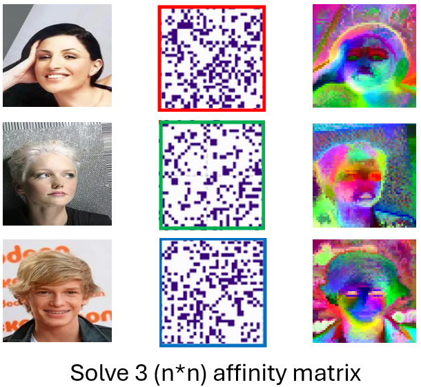
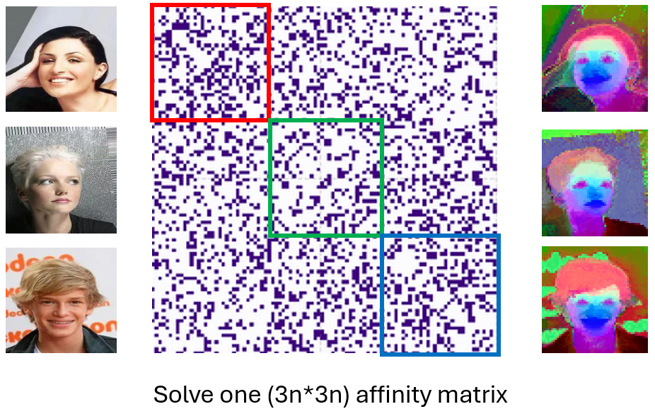
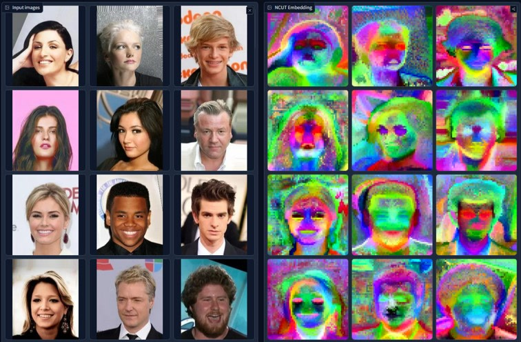

# Large-Scale Aligned NCUT across Images

- **NCut** processes each image independently. There's many small affinity matrix, each affinity matrix only contain pixels from one image.

    

- **AlignedCut** process all images as one large-scale graph cut. There's only one big affinity matrix that connects all images.

    

**AlignedCut** can discover better pattern that span multiple images. However, the size and complexity of affinity matrix is order of magnitude higher. The new developed Nystrom approximation solved the scalability and speed bottle-neck (see [How NCUT Works](how_ncut_works.md)).

## Pattern Discovered by AlignedCut

<!-- In this example, for NCut, the color of that 'Gibson Les Pual' guitar is arbitrary across images. For AlignedCut, the guitar is colored consistent across images. -->

<b>AlignedCut</b>: Color is aligned across images. <a href="https://huggingface.co/spaces/huzey/ncut-pytorch" target="_blank">Try on HuggingFace</a>
    

<b>NCut</b>: Color is <b>not</b> aligned across images. <a href="https://huggingface.co/spaces/huzey/ncut-pytorch" target="_blank">Try on HuggingFace</a>
    

---

## Correspondence from AlignedCut

Since the color is aligned across images, we build a simple software: it checks the distance (in eigenvector color) from one mouse pointer pixel to all the other pixels.

: A demo software for one-point prompting segmentation and pseudo-labeling.

<video width="90%" controls muted autoplay loop>
  <source src="../images/demo_heatmap.mp4" type="video/mp4">
</video>

Video: Heatmap is cosine distance of eigenvectors, w.r.t the mouse pointer.

---
<!-- 
## Pros and Cons

#### Pros (NCut):

- Simple: Uses fewer eigenvectors. The solution space contain less clusters because it's one image.

- Exact: No approximations. Approximation is not necessary for small-scale NCUT.

#### Cons (NCut):

- No Alignment: Color and distance aren't aligned across images. 

- Scalability Issues: Struggles with large pixel counts.

## Limitation of AlignedCut

Adding new images to existing eigenvector solution is not straight-forward, because the eigenvectors for new images need to be consistent with existing images. One solution is use KNN to propagate to new images, please see [Tutorial 3 - Adding Nodes](add_nodes.md).

> [1] AlignedCut: Visual Concepts Discovery on Brain-Guided Universal Feature Space, Huzheng Yang, James Gee\*, Jianbo Shi\*,2024
> 
> [2] Normalized Cuts and Image Segmentation, Jianbo Shi and Jitendra Malik, 2000 -->
