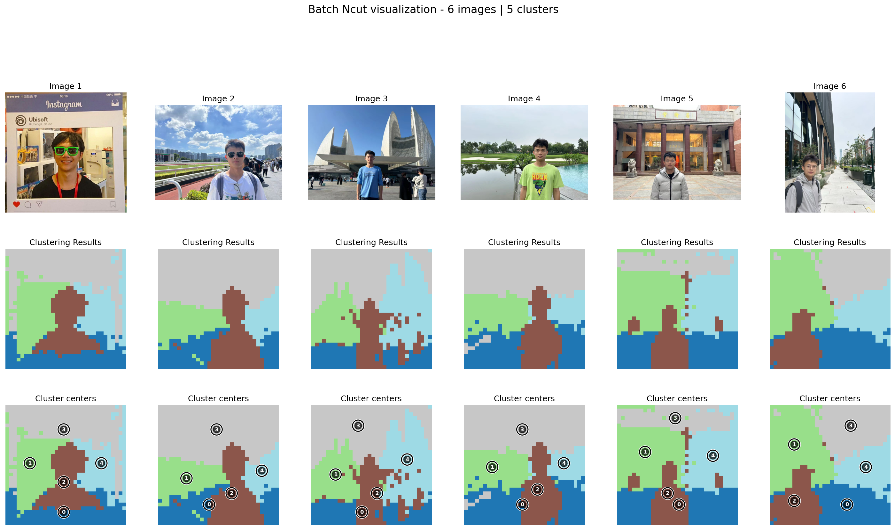
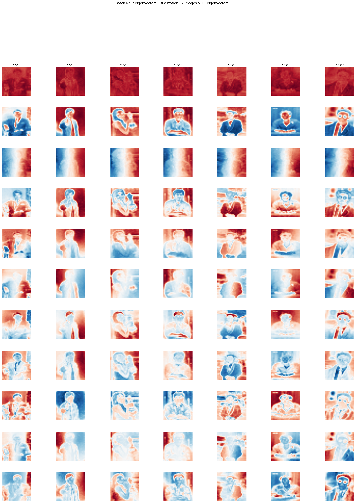
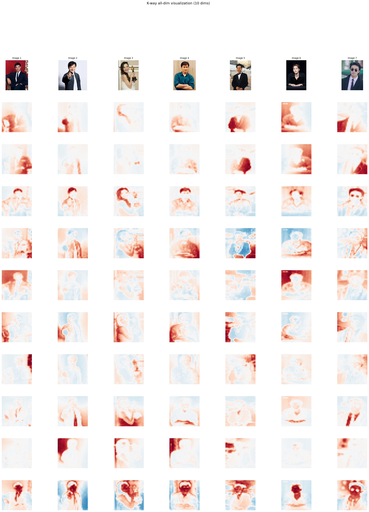

# Discrete NCut

We have used K-Way Ncut to discretize the clustering results. We can see the clustering results are changing while increasing K.

- kway_ncut uses axis_align to orthogonally align the continuous eigenvectors so that each class dominates one axis (i.e., `eigvec @ R`).
- axis_align performs subsampling (farthest_point_sampling), L2 normalization, initializes R from k farthest points, then iterates: project → argmax one-hot discretize → SVD (`D^T F`) → update `R = V U^T`, minimizing the NCut objective \(2\,(n - \sum S)\) until convergence.
- Final labels are obtained by argmax over rows (the index of the one-hot maximum).

The following image is calculated by the features of DINO V2.

<div id="discrete-ncut-slider" style="text-align:center;">
<div>

</div>
<div style="margin-top:8px;">
<label for="k-slider">k = <span id="k-value">5</span></label>
<input type="range" id="k-slider" min="5" max="10" step="1" value="5" />
</div>
</div>
<script>
(function(){
var slider = document.getElementById('k-slider');
var valueEl = document.getElementById('k-value');
var imgEl = document.getElementById('k-image');
if (!slider || !valueEl || !imgEl) return;
function update(){
  var k = parseInt(slider.value, 10);
  valueEl.textContent = k;
  imgEl.src = 'images/k_' + k + '.png';
  imgEl.alt = 'Discrete NCut result for k=' + k;
}
slider.addEventListener('input', update);
slider.addEventListener('change', update);
update();
})();
</script>
<noscript>
<p>JavaScript is disabled. Please view the results:</p>
<ul>
<li><a href="../images/k_5.png">k=5</a></li>
<li><a href="../images/k_6.png">k=6</a></li>
<li><a href="../images/k_7.png">k=7</a></li>
<li><a href="../images/k_8.png">k=8</a></li>
<li><a href="../images/k_9.png">k=9</a></li>
<li><a href="../images/k_10.png">k=10</a></li>
</ul>
</noscript>

We can see from the results that K should be an appropriate number. Large K tends to segment the images into more blocks while small K will only show an abstract segmentation restul of the feature space.


Example: compute K-way NCut from features
```python
import torch
from ncut_pytorch import Ncut, kway_ncut

# features: shape (n, d)
features = torch.rand(1960, 768)

# continuous eigenvectors from NCut, shape (n, k)
eigvecs = Ncut(n_eig=20).fit_transform(features)  # (1960, 20)

# align for discretization-friendly basis
kway_eigvecs = kway_ncut(eigvecs)

# cluster assignment and (axis-wise) centroids
cluster_assignment = kway_eigvecs.argmax(1)
cluster_centroids = kway_eigvecs.argmax(0) 
```


<div id="kway-toggle" style="text-align:center;">
<button id="kway-switch" style="margin-bottom:8px;">Switch to after k-way</button>

<div id="kway-before">
<p><strong>Before k-way (NCut eigenvectors)</strong></p>
<p>The first row is theoretically near-constant; deeper rows have higher spatial frequency.</p>
<div style="text-align:center;">

</div>
</div>

<div id="kway-after" style="display:none;">
<p><strong>After k-way (K-way projection channels, k=10)</strong></p>
<p>These are the 10 channel responses before one-hot; after alignment, channels become more axis-aligned (unimodal).</p>
<div style="text-align:center;">

</div>
</div>
</div>
<script>
(function(){
var btn = document.getElementById('kway-switch');
var beforeEl = document.getElementById('kway-before');
var afterEl = document.getElementById('kway-after');
if (!btn || !beforeEl || !afterEl) return;
var showAfter = false;
function render(){
  if (showAfter){
    beforeEl.style.display = 'none';
    afterEl.style.display = '';
    btn.textContent = 'Switch to before k-way';
  } else {
    beforeEl.style.display = '';
    afterEl.style.display = 'none';
    btn.textContent = 'Switch to after k-way';
  }
}
btn.addEventListener('click', function(){
  showAfter = !showAfter;
  render();
});
render();
})();
</script>
<noscript>
<p><em>JavaScript is disabled: both before/after k-way views are shown below.</em></p>
<p><strong>Before k-way</strong></p>

<p><strong>After k-way</strong></p>

</noscript>
