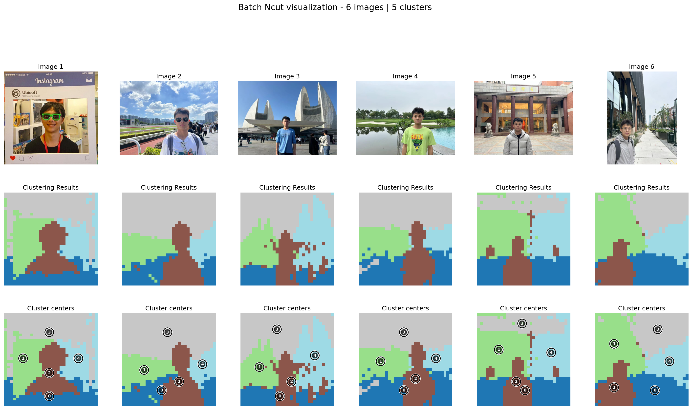
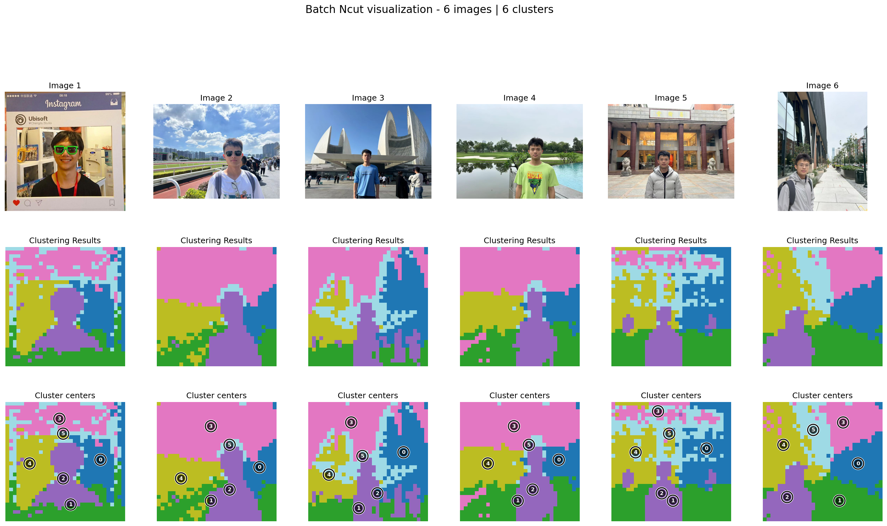
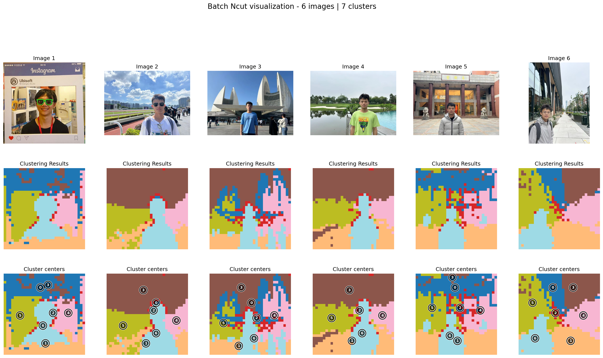

# Discrete NCut

We have used K-Way Ncut to discretize the clustering results. We can see the clustering results are changing while increasing K.

- kway_ncut uses axis_align to orthogonally align the continuous eigenvectors so that each class dominates one axis (i.e., `eigvec @ R`).
- axis_align performs subsampling (farthest_point_sampling), L2 normalization, initializes R from k farthest points, then iterates: project → argmax one-hot discretize → SVD (`D^T F`) → update `R = V U^T`, minimizing the NCut objective \(2\,(n - \sum S)\) until convergence.
- Final labels are obtained by argmax over rows (the index of the one-hot maximum).

The following image is calculated by the features of DINO V2.

<div class="kway-tabs" style="text-align:center;">
<input type="radio" id="k5" name="k" checked>
<label for="k5">k=5</label>
<input type="radio" id="k6" name="k">
<label for="k6">k=6</label>
<input type="radio" id="k7" name="k">
<label for="k7">k=7</label>
<input type="radio" id="k8" name="k">
<label for="k8">k=8</label>
<input type="radio" id="k9" name="k">
<label for="k9">k=9</label>
<input type="radio" id="k10" name="k">
<label for="k10">k=10</label>

<div class="kway-img k-img-5">

</div>
<div class="kway-img k-img-6">

</div>
<div class="kway-img k-img-7">

</div>
<div class="kway-img k-img-8">

</div>
<div class="kway-img k-img-9">

</div>
<div class="kway-img k-img-10">

</div>
</div>
<style>
.kway-tabs .kway-img{display:none;}
#k5:checked ~ .k-img-5{display:block;}
#k6:checked ~ .k-img-6{display:block;}
#k7:checked ~ .k-img-7{display:block;}
#k8:checked ~ .k-img-8{display:block;}
#k9:checked ~ .k-img-9{display:block;}
#k10:checked ~ .k-img-10{display:block;}
.kway-tabs label{margin:0 8px; cursor:pointer;}
</style>

We can see from the results that K should be an appropriate number. Large K tends to segment the images into more blocks while small K will only show an abstract segmentation restul of the feature space.


Example: compute K-way NCut from features
```python
import torch
from ncut_pytorch import Ncut, kway_ncut

# features: shape (n, d)
features = torch.rand(1960, 768)

# continuous eigenvectors from NCut, shape (n, k)
eigvecs = Ncut(n_eig=20).fit_transform(features)  # (1960, 20)

# align for discretization-friendly basis
kway_eigvecs = kway_ncut(eigvecs)

# cluster assignment and (axis-wise) centroids
cluster_assignment = kway_eigvecs.argmax(1)
cluster_centroids = kway_eigvecs.argmax(0)
```


Visualization of NCut eigenvectors (before k-way)
The first row is theoretically close to a constant; deeper rows show higher spatial frequencies.

<div style="text-align:center;">

</div>

Visualization of k-way projection channels (k=10)
Before argmax (i.e., before turning into one-hot), the 10 channel responses are visualized below. 

<div style="text-align:center;">

</div>
