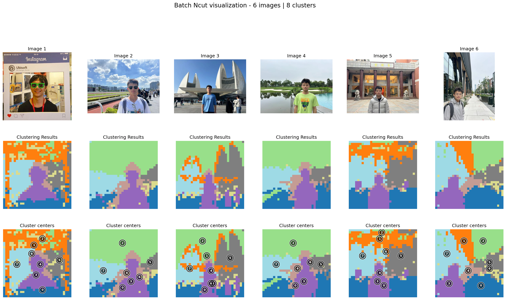
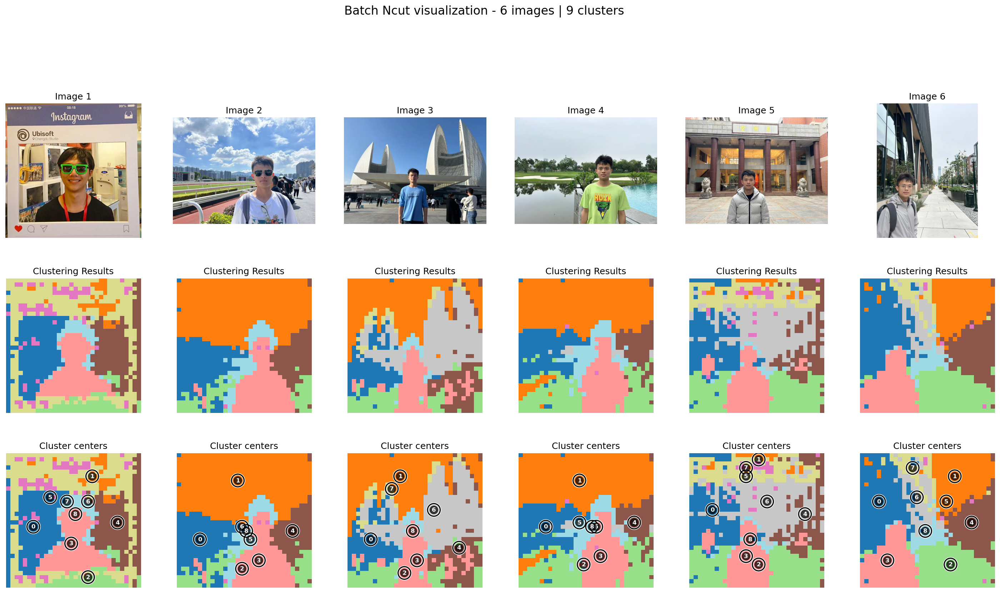
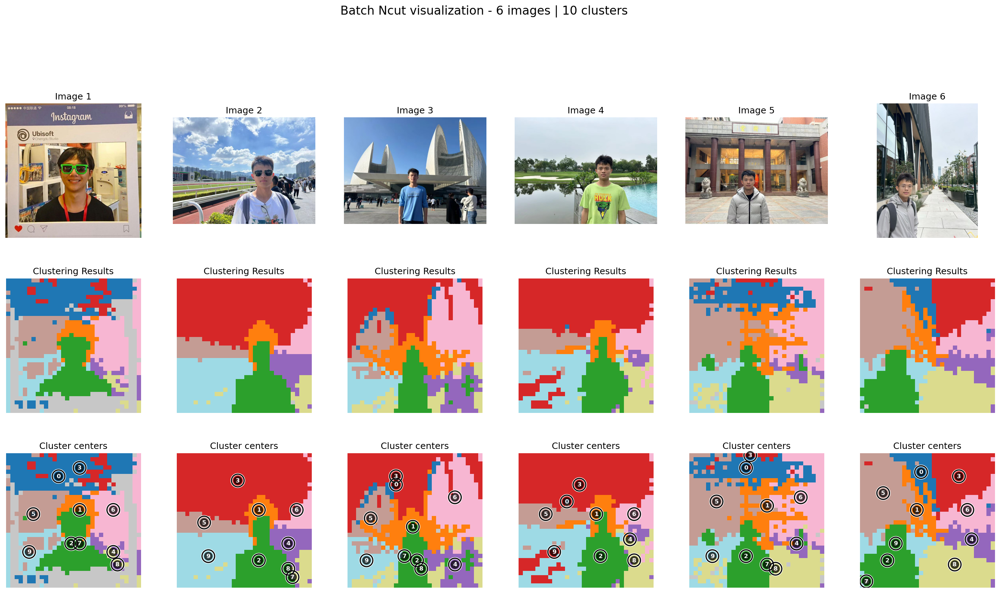
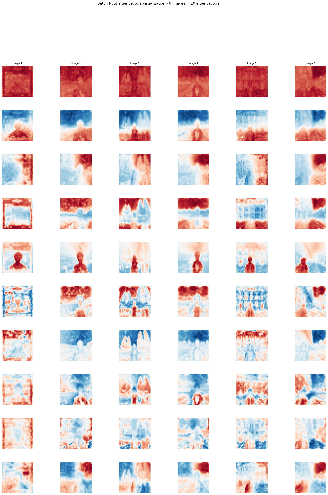
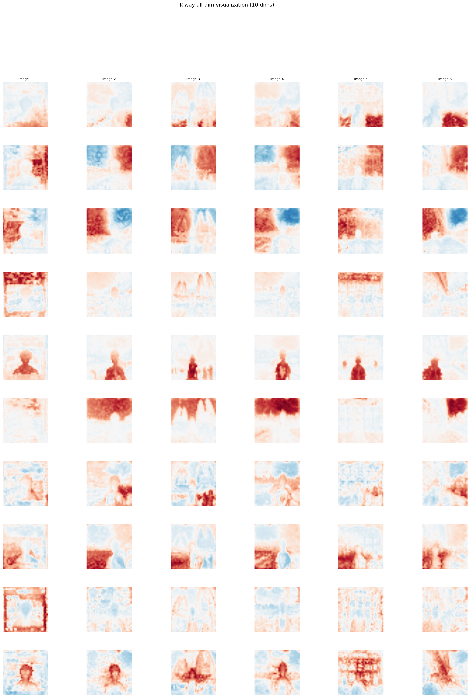

# Discrete NCut

We used the K-Way Ncut algorithm to discretize the clustering results. The discrete Ncut approach means that, instead of relying solely on the continuous partitioning obtained from the standard Ncut formulation, we explicitly assign each pixel feature to a specific category. In other words, it converts the continuous eigenvector representations into discrete cluster labels. 


## How to use it in a few lines
``` py

from ncut_pytorch.predictor import NcutDinov3Predictor
from PIL import Image

predictor = NcutDinov3Predictor(model_cfg="dinov3_vitl16")
predictor = predictor.to('cuda')

predictor.predictor.color_method = 'tsne' #can choose mspace

images = [Image.open("/mnt/disk1/ilykyleliam/liam/re.jpg")]
#can replace with a list of images images = [Image.open("../images/view_0.jpg"), Image.open("../images/view_1.jpg")]

predictor.set_images(images)
segments = predictor.generate(n_segment=20)
color = predictor.color_discrete(segments, draw_border=True)
color = color[0]

# save the color image
color.save("color.jpg")
```


Example: compute K-way NCut from features

The following images are calculated by the features of dinov3_vith16plus. The second line is the discrete NCUT assignments results and the third line is the clustering centroid. As we switch between different K, we can see the clustering results become different. The larger the K, the more detailed clustering restuls will appear but will also introduce some noise. As you can see the background is divided into different colors, this is because the effect of positional encoding of DINO structure.


<div class="kway-tabs" style="text-align:center;">
  <input type="radio" id="k5" name="k" checked>
  <label for="k5" class="kbtn">k=8</label>
  <input type="radio" id="k6" name="k">
  <label for="k6" class="kbtn">k=9</label>
  <input type="radio" id="k7" name="k">
  <label for="k7" class="kbtn">k=10</label>
  <input type="radio" id="k8" name="k">
  <label for="k8" class="kbtn">k=11</label>
  <input type="radio" id="k9" name="k">
  <label for="k9" class="kbtn">k=12</label>
  <input type="radio" id="k10" name="k">
  <label for="k10" class="kbtn">k=13</label>
  <input type="radio" id="k11" name="k">
  <label for="k11" class="kbtn">k=60</label>

<div class="kway-img k-img-5">
  
</div>
<div class="kway-img k-img-6">
  
</div>
<div class="kway-img k-img-7">
  
</div>
<div class="kway-img k-img-8">
  
</div>
<div class="kway-img k-img-9">
  
</div>
<div class="kway-img k-img-10">
  
</div>
<div class="kway-img k-img-11">
  
</div>
</div>
<style>
.kway-tabs input[type="radio"]{display:none;}
/* Default: hide all, show the selected image when radio works */
.kway-tabs .kway-img{display:none;}
#k5:checked ~ .k-img-5{display:block;}
#k6:checked ~ .k-img-6{display:block;}
#k7:checked ~ .k-img-7{display:block;}
#k8:checked ~ .k-img-8{display:block;}
#k9:checked ~ .k-img-9{display:block;}
#k10:checked ~ .k-img-10{display:block;}
#k11:checked ~ .k-img-11{display:block;}
.kbtn{display:inline-block; padding:6px 12px; border:1px solid var(--md-default-fg-color--lighter, #ccc); border-radius:6px; margin:0 4px; cursor:pointer;}
#k5:checked + label.kbtn, #k6:checked + label.kbtn, #k7:checked + label.kbtn, #k8:checked + label.kbtn, #k9:checked + label.kbtn, #k10:checked + label.kbtn, #k11:checked + label.kbtn{background: var(--md-primary-fg-color, #3f51b5); color: #fff; border-color: transparent;}
</style>
<style>
/* Enhance toggle buttons look */
.kway-toggle-bar{display:inline-flex; align-items:center; gap:6px;}
.kway-toggle-bar .md-button{border:1px solid var(--md-default-fg-color--lighter, #ccc); border-radius:6px; background: var(--md-default-bg-color, transparent); color: var(--md-default-fg-color, inherit); cursor:pointer; user-select:none; min-width: 140px;} 
.kway-toggle-bar .md-button--primary{background: var(--md-primary-fg-color, #3f51b5); color:#fff; border-color: transparent;}
.kway-toggle-bar .md-button:hover{filter: brightness(0.95);} 
.kway-toggle-bar .md-button:active{transform: translateY(1px);} 
</style>

From the visual results, it is evident that the choice of 
 k-the number of clusters—plays a crucial role in determining the segmentation granularity. When K is too large, the algorithm over-segments the image, splitting it into many small, fine-grained regions that may correspond to texture variations rather than meaningful semantic parts. Conversely, when K is too small, the segmentation becomes overly coarse, merging distinct areas into broad abstract regions that fail to capture local structure. Therefore, selecting an appropriate K balances detail and interpretability, leading to segmentation maps that align more closely with perceptually coherent regions or objects in the image.


If we want to see the intermediate outputs
<details>

<summary>
Click to expand full code

``` py
import torch
from ncut_pytorch import Ncut, kway_ncut

# features: shape (n, d)
features = torch.rand(1960, 768)

# continuous eigenvectors from NCut, shape (n, k)
eigvecs = Ncut(n_eig=20).fit_transform(features)  # (1960, 20)

# align for discretization-friendly basis
kway_eigvecs = kway_ncut(eigvecs)

# cluster assignment and (axis-wise) centroids
cluster_assignment = kway_eigvecs.argmax(1)
cluster_centroids = kway_eigvecs.argmax(0) 
```

</summary>

``` py linenums="1"

import torch
from PIL import Image
import torchvision.transforms as transforms
from ncut_pytorch import Ncut, kway_ncut


# DINO v3 model weights URL
DINOV3_URL = "https://huggingface.co/huzey/mydv3/resolve/master/dinov3_vith16plus_pretrain_lvd1689m-7c1da9a5.pth"

# Load and preprocess image
def preprocess_image(image_path, resolution=(448, 448)):
    image = Image.open(image_path).convert('RGB')
    transform = transforms.Compose([
        transforms.Resize(resolution),
        transforms.ToTensor(),
        transforms.Normalize([0.485, 0.456, 0.406], [0.229, 0.224, 0.225]),
    ])
    return transform(image).unsqueeze(0)  # Add batch dimension

# Extract DINO v3 features
def extract_dinov3_features(image_path, layer=11):
    # Setup device
    device = torch.device("cuda" if torch.cuda.is_available() else "cpu")
    print(f"Using device: {device}")

    # Load DINO v3 model
    model = torch.hub.load("facebookresearch/dinov3", "dinov3_vith16plus", weights=DINOV3_URL)
    model.eval()
    model.requires_grad_(False)
    model = model.to(device)

    # Preprocess image
    img_tensor = preprocess_image(image_path).to(device)

    # Extract features
    with torch.no_grad():
        features = model.get_intermediate_layers(img_tensor, reshape=True, 
                                                 n=list(range(12)))[layer]

    # Convert format: (1, D, H, W) -> (H, W, D)
    features = features.squeeze(0).permute(1, 2, 0).cpu()

    print(f"Feature shape: {features.shape}")  # (H, W, D)
    return features


# Usage example
if __name__ == "__main__":
    features = extract_dinov3_features("example.jpg", layer=11)
    h, w, d = features.shape
    flattened = features.reshape(h * w, d)
    eigvecs = Ncut(n_eig=20).fit_transform(flattened)
    # align for discretization-friendly basis
    kway_eigvecs = kway_ncut(eigvecs)
    # cluster assignment and (axis-wise) centroids
    cluster_assignment = kway_eigvecs.argmax(dim=1).reshape(h, w)
    cluster_centroids = kway_eigvecs.argmax(dim=0)

```

</details>


The visualization results below panels labeled “Before K-way” and “After K-way” highlight the difference between the raw eigenvectors produced by the standard NCut algorithm and the axis-aligned eigenvectors obtained after applying the K-way alignment.


(1) Before K-way: The eigenvectors exhibit smooth, continuous variations across the image. The eigenvectors of the first line are often nearly constant or represent low-frequency global structures, while deeper eigenvectors capture higher frequency information.

(2) After K-way: Once the K-way alignment is applied, each projection channel becomes more axis-aligned and unimodal, meaning that each cluster now has a dominant direction. This makes the clustering results clearer and easier to discretize. The improved separation between channels directly contributes to more stable and meaningful segmentation outcomes. You can see in the pictures that some channels are segmenting the human faces and some are segmenting the background.

<div id="kway-toggle" style="text-align:center;">
  <input type="radio" id="view-before" name="kview" checked>
  <label for="view-before" class="md-button kview-btn">Before k-way</label>
  <input type="radio" id="view-after" name="kview">
  <label for="view-after" class="md-button kview-btn">After k-way</label>

<div id="kway-before" class="kview-panel">
<p><strong>Before k-way (NCut eigenvectors)</strong></p>
<p>The first row is theoretically near-constant; deeper rows have higher frequency information.</p>
<div style="text-align:center;">

</div>
</div>

<div id="kway-after" class="kview-panel">
<p><strong>After k-way (K-way projection channels, k=11)</strong></p>
<p>These are the 11 channel responses before one-hot; after alignment, channels become more axis-aligned (unimodal).</p>
<div style="text-align:center;">

</div>
</div>
</div>
<style>
#kway-toggle input[type="radio"]{display:none;}
#kway-toggle .kview-btn{display:inline-block; padding:6px 14px; margin:0 4px 8px 4px; border:1px solid var(--md-default-fg-color--lighter, #ccc); border-radius:6px; cursor:pointer; user-select:none; min-width:140px;}
#view-before:checked + label.kview-btn{background: var(--md-primary-fg-color, #3f51b5); color:#fff; border-color: transparent;}
#view-after:checked + label.kview-btn{background: var(--md-primary-fg-color, #3f51b5); color:#fff; border-color: transparent;}
.kview-panel{display:none;}
#view-before:checked ~ #kway-before{display:block;}
#view-after:checked ~ #kway-after{display:block;}
</style>


