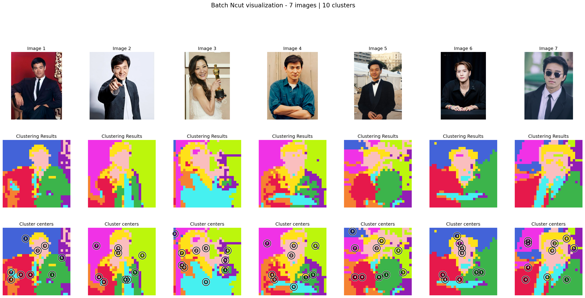

# Discrete NCut

We have used K-Way Ncut to discretize the clustering results. We can see the clustering results are changing while increasing K.

- kway_ncut uses axis_align to orthogonally align the continuous eigenvectors so that each class dominates one axis (i.e., `eigvec @ R`).
- axis_align performs subsampling (farthest_point_sampling), L2 normalization, initializes R from k farthest points, then iterates: project → argmax one-hot discretize → SVD (`D^T F`) → update `R = V U^T`, minimizing the NCut objective \(2\,(n - \sum S)\) until convergence.
- Final labels are obtained by argmax over rows (the index of the one-hot maximum).

The following image is calculated by the features of DINO V2.

<div class="kway-tabs" style="text-align:center;">
<div class="kway-controls" style="margin-bottom:8px;">
  <input type="radio" id="k5" name="k" checked>
  <label for="k5" class="kbtn">k=5</label>
  <input type="radio" id="k6" name="k">
  <label for="k6" class="kbtn">k=6</label>
  <input type="radio" id="k7" name="k">
  <label for="k7" class="kbtn">k=7</label>
  <input type="radio" id="k8" name="k">
  <label for="k8" class="kbtn">k=8</label>
  <input type="radio" id="k9" name="k">
  <label for="k9" class="kbtn">k=9</label>
  <input type="radio" id="k10" name="k">
  <label for="k10" class="kbtn">k=10</label>
</div>

<div class="kway-img k-img-5">
  
</div>
<div class="kway-img k-img-6">
  
</div>
<div class="kway-img k-img-7">
  
</div>
<div class="kway-img k-img-8">
  
</div>
<div class="kway-img k-img-9">
  
</div>
<div class="kway-img k-img-10">
  
</div>
</div>
<style>
.kway-tabs input[type="radio"]{display:none;}
/* Default: show all images. When a radio is checked, hide others and show the selected */
.kway-tabs .kway-img{display:block;}
#k5:checked ~ .kway-img{display:none;} #k5:checked ~ .k-img-5{display:block;}
#k6:checked ~ .kway-img{display:none;} #k6:checked ~ .k-img-6{display:block;}
#k7:checked ~ .kway-img{display:none;} #k7:checked ~ .k-img-7{display:block;}
#k8:checked ~ .kway-img{display:none;} #k8:checked ~ .k-img-8{display:block;}
#k9:checked ~ .kway-img{display:none;} #k9:checked ~ .k-img-9{display:block;}
#k10:checked ~ .kway-img{display:none;} #k10:checked ~ .k-img-10{display:block;}
.kway-controls .kbtn{display:inline-block; padding:6px 12px; border:1px solid var(--md-default-fg-color--lighter, #ccc); border-radius:6px; margin:0 4px; cursor:pointer;}
#k5:checked + label, #k6:checked + label, #k7:checked + label, #k8:checked + label, #k9:checked + label, #k10:checked + label{background: var(--md-primary-fg-color, #3f51b5); color: #fff; border-color: transparent;}
</style>

We can see from the results that K should be an appropriate number. Large K tends to segment the images into more blocks while small K will only show an abstract segmentation restul of the feature space.


Example: compute K-way NCut from features
```python
import torch
from ncut_pytorch import Ncut, kway_ncut

# features: shape (n, d)
features = torch.rand(1960, 768)

# continuous eigenvectors from NCut, shape (n, k)
eigvecs = Ncut(n_eig=20).fit_transform(features)  # (1960, 20)

# align for discretization-friendly basis
kway_eigvecs = kway_ncut(eigvecs)

# cluster assignment and (axis-wise) centroids
cluster_assignment = kway_eigvecs.argmax(1)
cluster_centroids = kway_eigvecs.argmax(0) 
```


<div id="kway-toggle" style="text-align:center;">
<div class="kway-toggle-bar" style="margin-bottom:8px;">
  <a id="btn-before" class="md-button md-button--primary" href="#" style="padding:6px 14px; margin-right:6px;">Before k-way</a>
  <a id="btn-after" class="md-button" href="#" style="padding:6px 14px;">After k-way</a>
  </div>

<div id="kway-before">
<p><strong>Before k-way (NCut eigenvectors)</strong></p>
<p>The first row is theoretically near-constant; deeper rows have higher spatial frequency.</p>
<div style="text-align:center;">

</div>
</div>

<div id="kway-after" style="display:none;">
<p><strong>After k-way (K-way projection channels, k=10)</strong></p>
<p>These are the 10 channel responses before one-hot; after alignment, channels become more axis-aligned (unimodal).</p>
<div style="text-align:center;">

</div>
</div>
</div>
<script>
(function(){
var btnBefore = document.getElementById('btn-before');
var btnAfter = document.getElementById('btn-after');
var beforeEl = document.getElementById('kway-before');
var afterEl = document.getElementById('kway-after');
if (!btnBefore || !btnAfter || !beforeEl || !afterEl) return;
var showAfter = false;
function render(){
  if (showAfter){
    beforeEl.style.display = 'none';
    afterEl.style.display = '';
    btnBefore.classList.remove('md-button--primary');
    btnAfter.classList.add('md-button--primary');
  } else {
    beforeEl.style.display = '';
    afterEl.style.display = 'none';
    btnAfter.classList.remove('md-button--primary');
    btnBefore.classList.add('md-button--primary');
  }
}
btnBefore.addEventListener('click', function(e){ e.preventDefault(); showAfter = false; render(); });
btnAfter.addEventListener('click', function(e){ e.preventDefault(); showAfter = true; render(); });
render();
})();
</script>
<noscript>
<p><em>JavaScript is disabled: both before/after k-way views are shown below.</em></p>
<p><strong>Before k-way</strong></p>

<p><strong>After k-way</strong></p>

</noscript>
