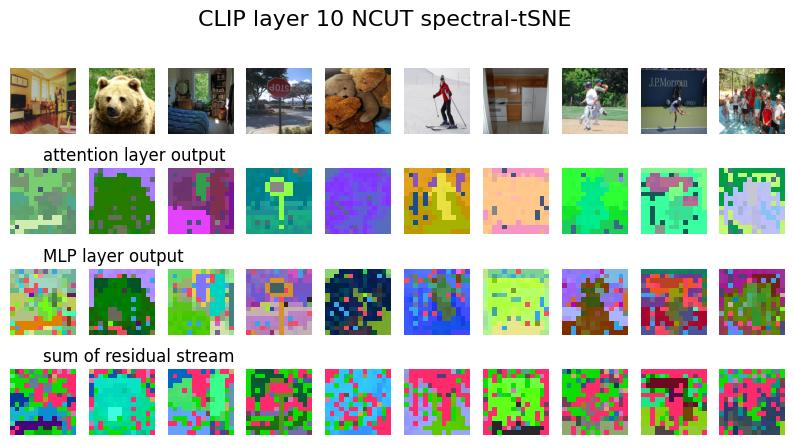

<details>

<summary>
Click to expand full code

``` py
class CLIP(torch.nn.Module):
```

</summary>

```py linenums="1"

# %%
from typing import Optional, Tuple
from einops import rearrange
import torch
from PIL import Image
import torchvision.transforms as transforms
from torch import nn
import numpy as np

# %%
class CLIP(torch.nn.Module):
    def __init__(self):
        super().__init__()

        from transformers import CLIPProcessor, CLIPModel

        model = CLIPModel.from_pretrained("openai/clip-vit-base-patch16")
        # processor = CLIPProcessor.from_pretrained("openai/clip-vit-base-patch16")
        self.model = model.eval().cuda()
        
        def new_forward(
            self,
            hidden_states: torch.Tensor,
            attention_mask: torch.Tensor,
            causal_attention_mask: torch.Tensor,
            output_attentions: Optional[bool] = False,
        ) -> Tuple[torch.FloatTensor]:

            residual = hidden_states

            hidden_states = self.layer_norm1(hidden_states)
            hidden_states, attn_weights = self.self_attn(
                hidden_states=hidden_states,
                attention_mask=attention_mask,
                causal_attention_mask=causal_attention_mask,
                output_attentions=output_attentions,
            )
            self.attn_output = hidden_states.clone()
            hidden_states = residual + hidden_states

            residual = hidden_states
            hidden_states = self.layer_norm2(hidden_states)
            hidden_states = self.mlp(hidden_states)
            self.mlp_output = hidden_states.clone()
            
            hidden_states = residual + hidden_states

            outputs = (hidden_states,)

            if output_attentions:
                outputs += (attn_weights,)

            self.block_output = hidden_states.clone()
            return outputs
        
        setattr(self.model.vision_model.encoder.layers[0].__class__, "forward", new_forward)

    @torch.no_grad()
    def forward(self, x): 

        out = self.model.vision_model(x)

        attn_outputs, mlp_outputs, block_outputs = [], [], []
        for i, blk in enumerate(self.model.vision_model.encoder.layers):
            attn_outputs.append(blk.attn_output)
            mlp_outputs.append(blk.mlp_output)
            block_outputs.append(blk.block_output)

        attn_outputs = torch.stack(attn_outputs)
        mlp_outputs = torch.stack(mlp_outputs)
        block_outputs = torch.stack(block_outputs)
        return attn_outputs, mlp_outputs, block_outputs


def image_dino_feature(
    images, resolution=(224, 224),
):
    if isinstance(images, list):
        assert isinstance(images[0], Image.Image), "Input must be a list of PIL images."
    else:
        assert isinstance(images, Image.Image), "Input must be a PIL image."
        images = [images]

    transform = transforms.Compose(
        [
            transforms.Resize(resolution),
            transforms.ToTensor(),
            transforms.Normalize([0.485, 0.456, 0.406], [0.229, 0.224, 0.225]),
        ]
    )

    feat_extractor = CLIP()

    attn_outputs, mlp_outputs, block_outputs = [], [], []
    for i, image in enumerate(images):
        torch_image = transform(image)
        # feat = feat_extractor(torch_image.unsqueeze(0).cuda()).cpu()
        attn_output, mlp_output, block_output = feat_extractor(
            torch_image.unsqueeze(0).cuda()
        )
        # feats.append(feat)
        attn_outputs.append(attn_output.cpu())
        mlp_outputs.append(mlp_output.cpu())
        block_outputs.append(block_output.cpu())
    attn_outputs = torch.cat(attn_outputs, dim=1)
    mlp_outputs = torch.cat(mlp_outputs, dim=1)
    block_outputs = torch.cat(block_outputs, dim=1)

    # feats = torch.cat(feats, dim=1)
    # feats = rearrange(feats, "l b c h w -> l b h w c")
    return attn_outputs, mlp_outputs, block_outputs


# %%
from torchvision.datasets import ImageFolder

dataset = ImageFolder("/data/coco/")
print("number of images in the dataset:", len(dataset))
# %%
images = [dataset[i][0] for i in range(20)]
attn_outputs, mlp_outputs, block_outputs = image_dino_feature(images)
# %%
print(attn_outputs.shape, mlp_outputs.shape, block_outputs.shape)
# %%
# remove 1 cls token
def reshape_output(outputs):
    from einops import rearrange
    outputs = rearrange(outputs[:, :, 1:, :], "l b (h w) c -> l b h w c", h=14, w=14)
    return outputs
attn_outputs = reshape_output(attn_outputs)
mlp_outputs = reshape_output(mlp_outputs)
block_outputs = reshape_output(block_outputs)
# %%
num_nodes = np.prod(attn_outputs.shape[1:4])


# %%
from ncut_pytorch import NCUT, rgb_from_tsne_3d

for i_layer in range(12):

    attn_eig, _ = NCUT(num_eig=100, device="cuda:0").fit_transform(
        attn_outputs[i_layer].reshape(-1, attn_outputs[i_layer].shape[-1])
    )
    _, attn_rgb = rgb_from_tsne_3d(attn_eig, device="cuda:0")
    attn_rgb = attn_rgb.reshape(attn_outputs[i_layer].shape[:3] + (3,))
    mlp_eig, _ = NCUT(num_eig=100, device="cuda:0").fit_transform(
        mlp_outputs[i_layer].reshape(-1, mlp_outputs[i_layer].shape[-1])
    )
    _, mlp_rgb = rgb_from_tsne_3d(mlp_eig, device="cuda:0")
    mlp_rgb = mlp_rgb.reshape(mlp_outputs[i_layer].shape[:3] + (3,))
    block_eig, _ = NCUT(num_eig=100, device="cuda:0").fit_transform(
        block_outputs[i_layer].reshape(-1, block_outputs[i_layer].shape[-1])
    )
    _, block_rgb = rgb_from_tsne_3d(block_eig, device="cuda:0")
    block_rgb = block_rgb.reshape(block_outputs[i_layer].shape[:3] + (3,))

    from matplotlib import pyplot as plt

    fig, axs = plt.subplots(4, 10, figsize=(10, 5))
    for ax in axs.flatten():
        ax.axis("off")
    for i_col in range(10):
        axs[0, i_col].imshow(images[i_col])
        axs[1, i_col].imshow(attn_rgb[i_col])
        axs[2, i_col].imshow(mlp_rgb[i_col])
        axs[3, i_col].imshow(block_rgb[i_col])

    axs[1, 0].set_title("attention layer output", ha="left")
    axs[2, 0].set_title("MLP layer output", ha="left")
    axs[3, 0].set_title("sum of residual stream", ha="left")

    plt.suptitle(f"CLIP layer {i_layer} NCUT spectral-tSNE", fontsize=16)
    # plt.show()
    save_dir = "/workspace/output/gallery/clip"
    import os
    os.makedirs(save_dir, exist_ok=True)
    plt.savefig(f"{save_dir}/clip_layer_{i_layer}.jpg", bbox_inches="tight")
    plt.close()
# %%

```

</details>


<div style="text-align: center;">
    
</div>
<div style="text-align: center;">
    
</div>
<div style="text-align: center;">
    
</div>
<div style="text-align: center;">
    
</div>
<div style="text-align: center;">
    
</div>
<div style="text-align: center;">
    
</div>
<div style="text-align: center;">
    
</div>
<div style="text-align: center;">
    
</div>
<div style="text-align: center;">
    
</div>
<div style="text-align: center;">
    
</div>
<div style="text-align: center;">
    
</div>
<div style="text-align: center;">
    
</div>
