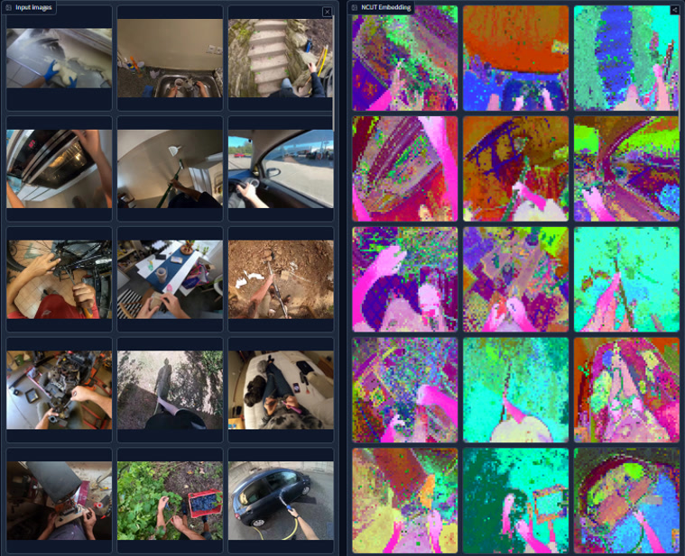
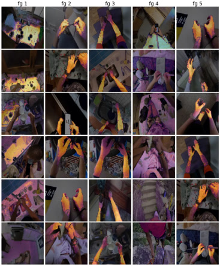
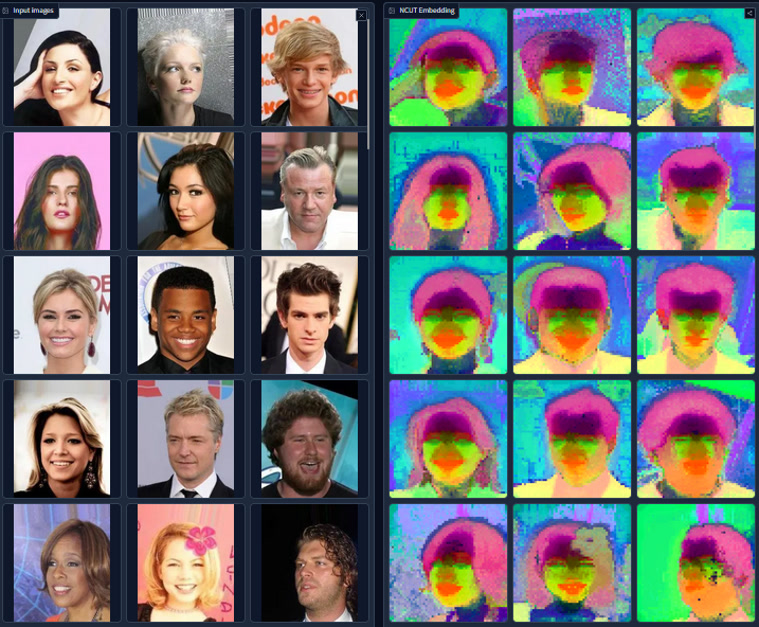
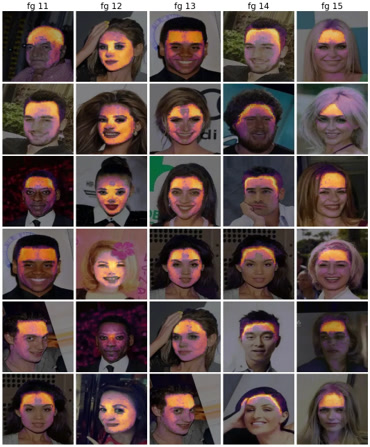
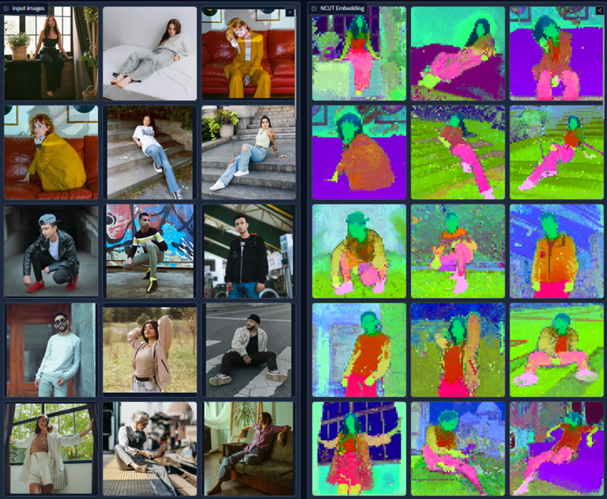
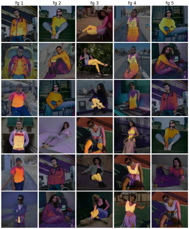
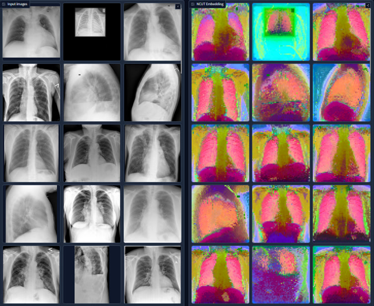
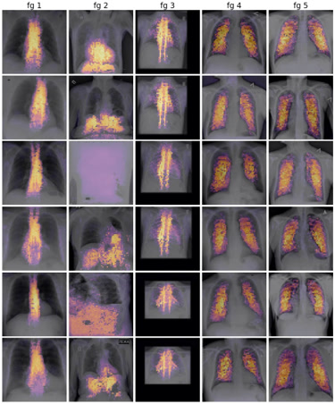
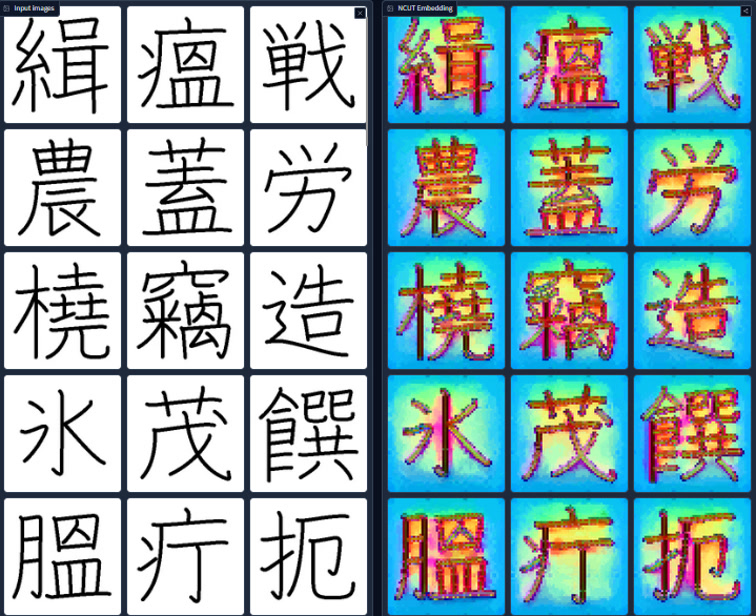
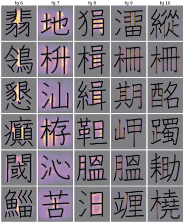

---
hide:
  - toc
---

# Dataset Gallery

NCUT works good for out-of-distribution datasets (see SET 4 and SET 5).

#### NCUT is Training-free Run-time Adaptation
No re-training, no fine-tune, the backbone is freezed. (Backbone model is DiNO in the blow examples)

The graph affinity adapt to images, even it's out-of-distribution: Nodes in the input set of images are contrasting against each other, thus makes the affinity matrix (in some sense it's a kernel matrix) adapts to out-of-distribution images.

---

##### Example 1

    
    

##### Example 2

    
    

##### Example 3

    
    

##### Example 4

    
    

##### Example 5

    
    

