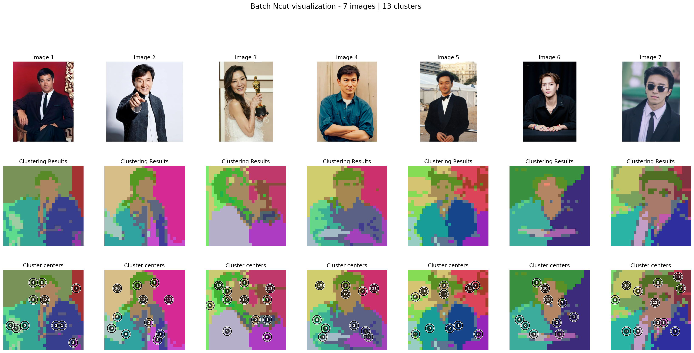

# Tutorial 2: Discrete NCut

This tutorial explores the **Discrete Normalized Cut (NCut)** approach using the [K-Way NCut algorithm](../methods/03_kway_ncut.md). Unlike standard NCut, which provides continuous eigenvector representations, Discrete NCut explicitly partitions data into distinct categories. By converting continuous eigenvectors into discrete cluster labels, this method facilitates the segmentation of images into semantically meaningful regions.

## Quick Start

The following example demonstrates how to perform discrete segmentation using the `NcutDinov3Predictor`.

```python
from ncut_pytorch.predictor import NcutDinov3Predictor
from PIL import Image

# Initialize the predictor with a specific model configuration
predictor = NcutDinov3Predictor(model_cfg="dinov3_vitl16")
predictor = predictor.to('cuda')

# Load an input image
# Note: You can also provide a list of images: 
# images = [Image.open("view_0.jpg"), Image.open("view_1.jpg")]
images = [Image.open("example.jpg")]

predictor.set_images(images)

# Generate segmentation masks with a specified number of segments
segments = predictor.generate(n_segment=20)

# Create a colored visualization of the segmentation (with borders)
color = predictor.color_discrete(segments, draw_border=True)
output_image = color[0]

# Save the result
output_image.save("segments.jpg")
```

## Understanding K-way NCut Segmentation

The visualizations below illustrate the results of applying K-way NCut to features extracted from a **DINOv3 (ViT-H/16+)** model. The layout presents the original image, the discrete NCut assignments, and the clustering centroids.

The choice of $K$ (the number of clusters) significantly impacts the segmentation granularity:

*   **Larger $K$**: Results in finer segmentation, capturing more detail but potentially introducing noise or over-segmenting coherent objects.
*   **Smaller $K$**: Produces coarser segmentation, merging distinct areas into broader regions.
*   **Positional Encoding**: You may observe background segmentation patterns; these are often artifacts of the DINO architecture's positional encoding.

Use the tabs below to observe how the segmentation evolves with different values of $K$.

<div class="kway-tabs" style="text-align:center;">
  <input type="radio" id="k5" name="k" checked>
  <label for="k5" class="kbtn">k=8</label>
  <input type="radio" id="k6" name="k">
  <label for="k6" class="kbtn">k=9</label>
  <input type="radio" id="k7" name="k">
  <label for="k7" class="kbtn">k=10</label>
  <input type="radio" id="k8" name="k">
  <label for="k8" class="kbtn">k=11</label>
  <input type="radio" id="k9" name="k">
  <label for="k9" class="kbtn">k=12</label>
  <input type="radio" id="k10" name="k">
  <label for="k10" class="kbtn">k=13</label>
  <input type="radio" id="k11" name="k">
  <label for="k11" class="kbtn">k=60</label>

<div class="kway-img k-img-5">
  
</div>
<div class="kway-img k-img-6">
  
</div>
<div class="kway-img k-img-7">
  
</div>
<div class="kway-img k-img-8">
  
</div>
<div class="kway-img k-img-9">
  
</div>
<div class="kway-img k-img-10">
  
</div>
<div class="kway-img k-img-11">
  
</div>
</div>
<style>
.kway-tabs input[type="radio"]{display:none;}
/* Default: hide all, show the selected image when radio works */
.kway-tabs .kway-img{display:none;}
#k5:checked ~ .k-img-5{display:block;}
#k6:checked ~ .k-img-6{display:block;}
#k7:checked ~ .k-img-7{display:block;}
#k8:checked ~ .k-img-8{display:block;}
#k9:checked ~ .k-img-9{display:block;}
#k10:checked ~ .k-img-10{display:block;}
#k11:checked ~ .k-img-11{display:block;}
.kbtn{display:inline-block; padding:6px 12px; border:1px solid var(--md-default-fg-color--lighter, #ccc); border-radius:6px; margin:0 4px; cursor:pointer;}
#k5:checked + label.kbtn, #k6:checked + label.kbtn, #k7:checked + label.kbtn, #k8:checked + label.kbtn, #k9:checked + label.kbtn, #k10:checked + label.kbtn, #k11:checked + label.kbtn{background: var(--md-primary-fg-color, #3f51b5); color: #fff; border-color: transparent;}
</style>
<style>
/* Enhance toggle buttons look */
.kway-toggle-bar{display:inline-flex; align-items:center; gap:6px;}
.kway-toggle-bar .md-button{border:1px solid var(--md-default-fg-color--lighter, #ccc); border-radius:6px; background: var(--md-default-bg-color, transparent); color: var(--md-default-fg-color, inherit); cursor:pointer; user-select:none; min-width: 140px;} 
.kway-toggle-bar .md-button--primary{background: var(--md-primary-fg-color, #3f51b5); color:#fff; border-color: transparent;}
.kway-toggle-bar .md-button:hover{filter: brightness(0.95);} 
.kway-toggle-bar .md-button:active{transform: translateY(1px);} 
</style>

### The Role of K

As demonstrated above, selecting an appropriate $K$ is a trade-off between detail and interpretability. An optimal $K$ yields segmentation maps that align closely with perceptually coherent regions or objects, avoiding both the over-segmentation of textures and the under-segmentation of distinct structural elements.

## Intermediate Outputs and Implementation Details

For a deeper understanding of the process, we can examine the intermediate outputs, specifically the transition from continuous eigenvectors to discrete clusters.

<details>
<summary><strong>Click to expand full implementation code</strong></summary>

```python
import torch
from ncut_pytorch import Ncut, kway_ncut

# 1. Example features: shape (n, d)
features = torch.rand(1960, 768)

# 2. Compute continuous eigenvectors from NCut, shape (n, k)
# These vectors represent the continuous partitioning of the graph
eigvecs = Ncut(n_eig=20).fit_transform(features)  # (1960, 20)

# 3. Align for discretization-friendly basis
# K-way NCut rotates/transforms the eigenvectors to be more axis-aligned
kway_eigvecs = kway_ncut(eigvecs)

# 4. Cluster assignment and (axis-wise) centroids
# Assign each node to the cluster corresponding to the max value in the aligned vector
cluster_assignment = kway_eigvecs.argmax(1)
cluster_centroids = kway_eigvecs.argmax(0) 
```

```python linenums="1"
import torch
from PIL import Image
import torchvision.transforms as transforms
from ncut_pytorch import Ncut, kway_ncut

# DINO v3 model weights URL
DINOV3_URL = "https://huggingface.co/huzey/mydv3/resolve/master/dinov3_vith16plus_pretrain_lvd1689m-7c1da9a5.pth"

def preprocess_image(image_path, resolution=(448, 448)):
    """Load and normalize image for model input."""
    image = Image.open(image_path).convert('RGB')
    transform = transforms.Compose([
        transforms.Resize(resolution),
        transforms.ToTensor(),
        transforms.Normalize([0.485, 0.456, 0.406], [0.229, 0.224, 0.225]),
    ])
    return transform(image).unsqueeze(0)  # Add batch dimension

def extract_dinov3_features(image_path, layer=11):
    """Extract features from a specific layer of DINO v3."""
    device = torch.device("cuda" if torch.cuda.is_available() else "cpu")
    print(f"Using device: {device}")

    # Load DINO v3 model
    model = torch.hub.load("facebookresearch/dinov3", "dinov3_vith16plus", weights=DINOV3_URL)
    model.eval()
    model.requires_grad_(False)
    model = model.to(device)

    # Preprocess image
    img_tensor = preprocess_image(image_path).to(device)

    # Extract features
    with torch.no_grad():
        features = model.get_intermediate_layers(img_tensor, reshape=True, 
                                                 n=list(range(12)))[layer]

    # Convert format: (1, D, H, W) -> (H, W, D)
    features = features.squeeze(0).permute(1, 2, 0).cpu()

    print(f"Feature shape: {features.shape}")
    return features

# Usage example
if __name__ == "__main__":
    # 1. Extract Features
    features = extract_dinov3_features("example.jpg", layer=11)
    h, w, d = features.shape
    flattened = features.reshape(h * w, d)
    
    # 2. Compute Continuous Eigenvectors
    eigvecs = Ncut(n_eig=20).fit_transform(flattened)
    
    # 3. Align Basis for Discretization (K-way NCut)
    kway_eigvecs = kway_ncut(eigvecs)
    
    # 4. Generate Cluster Assignments
    cluster_assignment = kway_eigvecs.argmax(dim=1).reshape(h, w)
    cluster_centroids = kway_eigvecs.argmax(dim=0)
```

</details>


### Visualization: Before vs. After K-way Alignment

The panels below compare the raw eigenvectors from the standard NCut algorithm with the axis-aligned projection channels obtained after K-way alignment.

1.  **Before K-way (NCut Eigenvectors)**: The eigenvectors show smooth, continuous variations. Early eigenvectors typically capture low-frequency global structures (often nearly constant), while later ones capture higher-frequency details.
2.  **After K-way (Aligned Channels)**: Applying K-way alignment transforms these vectors into more axis-aligned, unimodal representations. Each channel tends to highlight a specific cluster (e.g., a face or a background region), making the results significantly sharper and easier to discretize.

<div id="kway-toggle" style="text-align:center;">
  <input type="radio" id="view-before" name="kview" checked>
  <label for="view-before" class="md-button kview-btn">Before k-way</label>
  <input type="radio" id="view-after" name="kview">
  <label for="view-after" class="md-button kview-btn">After k-way</label>

<div id="kway-before" class="kview-panel">
<p><strong>Before k-way (NCut eigenvectors)</strong></p>
<p>The first row is theoretically near-constant; deeper rows have higher frequency information.</p>
<div style="text-align:center;">

</div>
</div>

<div id="kway-after" class="kview-panel">
<p><strong>After k-way (K-way projection channels, k=11)</strong></p>
<p>These are the 11 eigvec responses before one-hot; after alignment, eigvec become more axis-aligned (unimodal).</p>
<div style="text-align:center;">

</div>
</div>
</div>
<style>
#kway-toggle input[type="radio"]{display:none;}
#kway-toggle .kview-btn{display:inline-block; padding:6px 14px; margin:0 4px 8px 4px; border:1px solid var(--md-default-fg-color--lighter, #ccc); border-radius:6px; cursor:pointer; user-select:none; min-width:140px;}
#view-before:checked + label.kview-btn{background: var(--md-primary-fg-color, #3f51b5); color:#fff; border-color: transparent;}
#view-after:checked + label.kview-btn{background: var(--md-primary-fg-color, #3f51b5); color:#fff; border-color: transparent;}
.kview-panel{display:none;}
#view-before:checked ~ #kway-before{display:block;}
#view-after:checked ~ #kway-after{display:block;}
</style>
