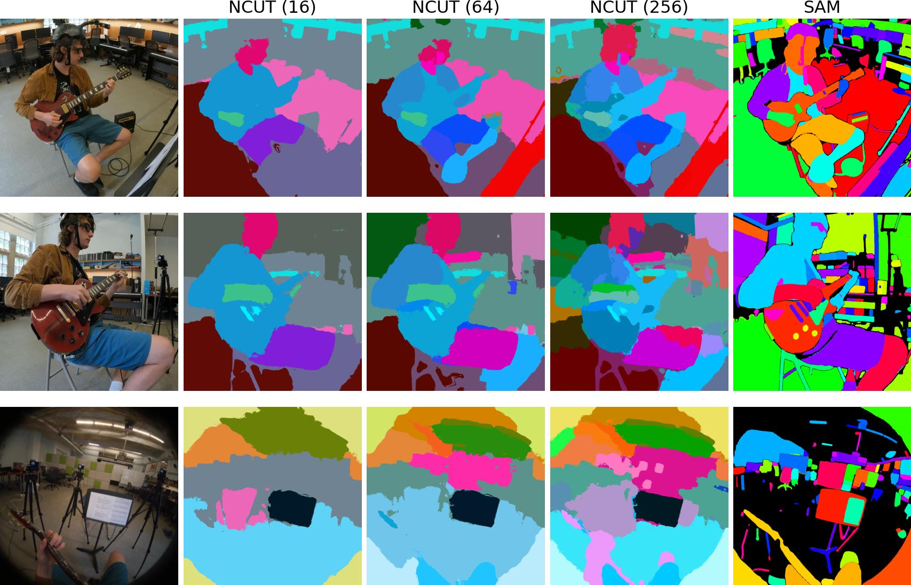

  

  <a href="https://github.com/huzeyann/ncut_pytorch" target="_blank" style="width: 30%; text-align: center; background-color: #007BFF; color: white; padding: 10px; border-radius: 5px; margin-right: 2%; margin-bottom: 10px;">
     GitHub
  </a>

  <a href="https://huggingface.co/spaces/huzey/ncut-pytorch" target="_blank" style="width: 30%; text-align: center; background-color: #FF5733; color: white; padding: 10px 20px; text-decoration: none; border-radius: 5px; margin-right: 2%; margin-bottom: 10px;">
    🤗 Demo
  </a>

  

    📝 Paper (Coming)
  

    <pre><code class="language-shell">pip install ncut-pytorch</code></pre>

# NCUT: Nyström Normalized Cut

**Normalized Cut**, aka. spectral clustering, is a graphical method to analyze data grouping in the affinity eigenvector space. It has been widely used for unsupervised segmentation in the 2000s.

**Nyström Normalized Cut**, is a new approximation algorithm developed for large-scale graph cuts,  a large-graph of million nodes can be processed in under 10s (cpu) or 2s (gpu).  

<video width="90%" controls muted autoplay loop>
  <source src="./images/ncut_video_sam_264_small.mp4" type="video/mp4">
</video>

Video: NCUT applied to image encoder features from Segment Anything Model.   RGB color is 3D spectral-tSNE embedding of NCUT eigenvectors.
<a href="./gallery_sam_video">code</a>

NCUT on DiNO features segmentation at various granularity.   NCUT segments coloring is aligned across images, SAM color is arbitrary.

<b>PROCEDURE <a href="./how_ncut_works">How NCUT Works</a></b>

1. <b>Feature Extraction</b>: extract feature from pre-trained model. 
2. <b>NCUT</b>: compute 100 NCUT eigenvectors, input feature is from deep models.  

**Demo Application**: Point-Prompting Segmentation tool for pseudo-labeling across multiple images. Try it in <a href="https://huggingface.co/spaces/huzey/ncut-pytorch" target="_blank">🤗HuggingFace</a> (Switch to the Tab "Application"). More Examples in [Gallery](gallery_application.md).

<video width="90%" controls muted autoplay loop>
  <source src="./images/demo_heatmap.mp4" type="video/mp4">
</video>

Video: Heatmap is cosine distance of eigenvectors, w.r.t the mouse pointer.
<a href="./alignedcut_vs_ncut">details</a>

<!-- ## Demo -->

<!-- Please visit the <a href="https://huggingface.co/spaces/huzey/ncut-pytorch" target="_blank">🤗HuggingFace Demo</a>. Play around datasets and models. -->

<!--

-->

<gradio-app src="https://huzey-ncut-pytorch.hf.space"></gradio-app>

<!-- <iframe
	src="https://huzey-ncut-pytorch.hf.space"
	frameborder="0"
	width="100%"
	height="800"
></iframe> -->

## Gallery
Just plugin features extracted from any pre-trained model and ready to go. NCUT works for any input -- image, text, video, 3D, .... Planty examples code and plots in the [Gallery](gallery.md)

---

## Installation

#### 1. Install PyTorch

<pre><code class="language-shell">conda install pytorch torchvision torchaudio pytorch-cuda=11.8 -c pytorch -c nvidia
</code></pre>

#### 2. Install `ncut-pytorch`

    <pre><code class="language-shell">pip install ncut-pytorch</code></pre>

#### Installation Trouble Shooting

In case of `pip` install <a style="color: red;">error</a>, please try install the build dependencies.

Option A:

    <pre style="display: inline;"><code class="language-shell">sudo apt-get update && sudo apt-get install build-essential cargo rustc -y</code></pre>

Option B:

    <pre><code class="language-shell">conda install rust -c conda-forge</code></pre>

Option C:

    <pre><code class="language-shell">curl --proto '=https' --tlsv1.2 -sSf https://sh.rustup.rs | sh && . "$HOME/.cargo/env"</code></pre>

---

## Quick Start

Minimal example on how to run NCUT, more examples in [Tutorial](tutorials.md) and [Gallery](gallery.md).

    <pre><code>
<b>import</b> torch
<b>from</b> ncut_pytorch <b>import</b> NCUT, rgb_from_tsne_3d

model_features = torch.rand(20, 64, 64, 768)  # (B, H, W, C)

inp = model_features.reshape(-1, 768)  # flatten
eigvectors, eigvalues = NCUT(num_eig=100, device='cuda:0').fit_transform(inp)
tsne_x3d, tsne_rgb = rgb_from_tsne_3d(eigvectors, device='cuda:0')

eigvectors = eigvectors.reshape(20, 64, 64, 100)  # (B, H, W, num_eig)
tsne_rgb = tsne_rgb.reshape(20, 64, 64, 3)  # (B, H, W, 3)
    </code></pre>

#### Load Feature Extractor Model

Any backbone model works as plug-in feature extractor. 
We have implemented some backbone models, here is a list of available models:

 <pre><code> 
<b>from</b> ncut_pytorch.backbone <b>import</b> list_models 
print(list_models()) 
[
  'SAM2(sam2_hiera_t)', 'SAM2(sam2_hiera_s)', 'SAM2(sam2_hiera_b+)', 'SAM2(sam2_hiera_l)', 
  'SAM(sam_vit_b)', 'SAM(sam_vit_l)', 'SAM(sam_vit_h)', 'MobileSAM(TinyViT)', 
  'DiNOv2reg(dinov2_vits14_reg)', 'DiNOv2reg(dinov2_vitb14_reg)', 'DiNOv2reg(dinov2_vitl14_reg)', 'DiNOv2reg(dinov2_vitg14_reg)', 
  'DiNOv2(dinov2_vits14)', 'DiNOv2(dinov2_vitb14)', 'DiNOv2(dinov2_vitl14)', 'DiNOv2(dinov2_vitg14)', 
  'DiNO(dino_vits8_896)', 'DiNO(dino_vitb8_896)', 'DiNO(dino_vits8_672)', 'DiNO(dino_vitb8_672)', 'DiNO(dino_vits8_448)', 'DiNO(dino_vitb8_448)', 'DiNO(dino_vits16_448)', 'DiNO(dino_vitb16_448)',
  'Diffusion(stabilityai/stable-diffusion-2)', 'Diffusion(CompVis/stable-diffusion-v1-4)', 'Diffusion(stabilityai/stable-diffusion-3-medium-diffusers)',
  'CLIP(ViT-B-16/openai)', 'CLIP(ViT-L-14/openai)', 'CLIP(ViT-H-14/openai)', 'CLIP(ViT-B-16/laion2b_s34b_b88k)', 
  'CLIP(convnext_base_w_320/laion_aesthetic_s13b_b82k)', 'CLIP(convnext_large_d_320/laion2b_s29b_b131k_ft_soup)', 'CLIP(convnext_xxlarge/laion2b_s34b_b82k_augreg_soup)', 
  'CLIP(eva02_base_patch14_448/mim_in22k_ft_in1k)', "CLIP(eva02_large_patch14_448/mim_m38m_ft_in22k_in1k)",
  'MAE(vit_base)', 'MAE(vit_large)', 'MAE(vit_huge)', 
  'ImageNet(vit_base)'
]
<b>from</b> ncut_pytorch.backbone_text <b>import</b> list_models 
print(list_models()) 
["meta-llama/Meta-Llama-3.1-8B", "meta-llama/Meta-Llama-3-8B", "gpt2"]
 </code></pre> 

#### Image model example:

 <pre><code> 
<b>import</b> torch <b>from</b> ncut_pytorch <b>import</b> NCUT, rgb_from_tsne_3d 
<b>from</b> ncut_pytorch.backbone <b>import</b> load_model, extract_features

model = load_model(model_name="SAM(sam_vit_b)") 
images = torch.rand(20, 3, 1024, 1024) 
model_features = extract_features(images, model, node_type='attn', layer=6) 
# model_features = model(images)['attn'][6]  # this also works

inp = model_features.reshape(-1, 768) # flatten
eigvectors, eigvalues = NCUT(num_eig=100, device='cuda:0').fit_transform(inp) 
tsne_x3d, tsne_rgb = rgb_from_tsne_3d(eigvectors, device='cuda:0')

eigvectors = eigvectors.reshape(20, 64, 64, 100) # (B, H, W, num_eig) 
tsne_rgb = tsne_rgb.reshape(20, 64, 64, 3) # (B, H, W, 3) </code></pre>

#### Text model example:

This example use your access token and download Llama from HuggingFace. How to set up Llama access token from HuggingFace (click to expand):

Step 1: Request access for Llama from <a ref="https://huggingface.co/meta-llama/Meta-Llama-3.1-8B" target="_blank">https://huggingface.co/meta-llama/Meta-Llama-3.1-8B</a>

Step 2: Find your access token at <a ref="https://huggingface.co/settings/tokens" target="_blank">https://huggingface.co/settings/tokens</a> 

    <pre><code>
<b>import</b> os
<b>from</b> ncut_pytorch <b>import</b> NCUT, rgb_from_tsne_3d
<b>from</b> ncut_pytorch.backbone_text <b>import</b> load_text_model

os.environ['HF_ACCESS_TOKEN'] = "your_huggingface_token"
llama = load_text_model("meta-llama/Meta-Llama-3.1-8B").cuda()
output_dict = llama("The quick white fox jumps over the lazy cat.")

model_features = output_dict['block'][31].squeeze(0)  # 32nd block output
token_texts = output_dict['token_texts']
eigvectors, eigvalues = NCUT(num_eig=5, device='cuda:0').fit_transform(model_features)
tsne_x3d, tsne_rgb = rgb_from_tsne_3d(eigvectors, device='cuda:0')
# eigvectors.shape[0] == tsne_rgb.shape[0] == len(token_texts)
    </code></pre>

---

## Why NCUT

Normalized cut offers two advantages:

1. soft-cluster assignments as eigenvectors

2. hierarchical clustering by varying the number of eigenvectors

<video width="80%" controls muted autoplay loop>
  <source src="./images/n_eigvecs.mp4" type="video/mp4">
</video>

Video: Heatmap is cosine distance of eigenvectors, w.r.t the mouse pixel (blue point). 
Reduce `n_eig` hierarchical grow the object heatmap 
try it at <a href="https://huggingface.co/spaces/huzey/ncut-pytorch" target="_blank">🤗HuggingFace Demo</a> (switch to tab "PlayGround")

Please see [NCUT and t-SNE/UMAP](compare.md) for a comparison over common PCA, t-SNE, UMAP.

---

> paper in prep, Yang 2024
>
> AlignedCut: Visual Concepts Discovery on Brain-Guided Universal Feature Space, Huzheng Yang, James Gee\*, Jianbo Shi\*,2024
> 
> Normalized Cuts and Image Segmentation, Jianbo Shi and Jitendra Malik, 2000
